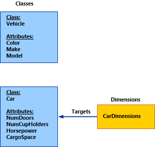
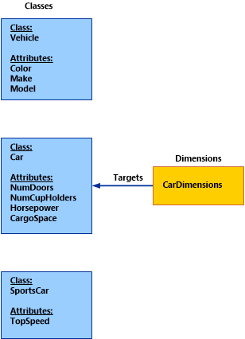

# About Dimensions in the Data Warehouse
A dimension in the Service Manager data warehouse in [!INCLUDE[smlong12](../../../sm/deploy/deploy-guide/includes/smlong12_md.md)] is roughly analogous to a management pack class. Each management class has a list of properties, while each dimension contains a list of attributes. Each dimension attribute corresponds to one property in a class.  
  
 Suppose that a user wants a report in Service Manager to display some information about the attributes for the computers in a particular domain. For example, the user may want to know the IP address, number of logical processors, and Domain Name System \(DNS\) name for each computer. Using dimensions, the user can bring the data over from Service Manager to the data warehouse where reports can query and display this data for each computer.  
  
 In the Service Manager data warehouse, a dimension always targets a single class. The dimension attributes then map to the target class’s properties. In this example, to get the information about the attributes from a computer, there is a computer dimension that is targeted at the Microsoft.Windows.Computers class.  
  
 In certain cases that are described in further detail in this topic, a dimension may also map to the properties of a target class’s base and derived classes. Therefore, while a dimension may be roughly analogous to a management pack class, it can also contain properties that are within that management pack class’s hierarchy.  
  
 You can see an example of how a dimension is used in the Activity Distribution report. In the report, under **Select affected configuration item \(optional\)**, when you click **Add**, the **Select dimension objects** box opens and you can search for dimension instances in the ConfigItemDim dimension. You can filter on the **Display Name** property. When you select **All Windows Computers** as the dimension object, the report header is updated with the selected filter value. When you run the report, only activities that affect the selected configuration item, **All Windows Computers**, are displayed.  
  
 To see how the dimension was modeled, you can look at the System.Entity and System.ConfigItem classes that are defined in the System.Library management pack:  
  
```  
<ClassType ID="System.Entity" Accessibility="Public" Hosted="false" Abstract="true" Singleton="false">    
<Property ID="DisplayName" Type="string" MinLength="0" Key="false" CaseSensitive="false" MaxLength="4000" />    
</ClassType>  
```  
  
```  
<ClassType ID="System.ConfigItem" Base="System.Entity" Accessibility="Public" Hosted="false" Abstract="true">   
<Property ID="ObjectStatus" Type="enum" EnumType="System.ConfigItem.ObjectStatusEnum" DefaultValue="System.ConfigItem.ObjectStatusEnum.Active" />    
<Property ID="AssetStatus" Type="enum" EnumType="System.ConfigItem.AssetStatusEnum" />   
<Property ID="Notes" Type="richtext" MaxLength="4000" />   
</ClassType>  
```  
  
 To revise the configuration item dimension to target the ObjectStatus and AssetStatus properties of System.ConfigItem and the DisplayName property of the base class System.Library, you can define the dimension with the following three properties as attributes:  
  
```  
<Dimension ID="ConfigItemDim" Accessibility="Public" Target="System!System.ConfigItem" InferredDimension="true" HierarchySupport="Exact" Reconcile="true">    
<InclusionAttribute ID="DisplayName" PropertyPath="$Context/Property[Type='System!System.Entity']/DisplayName$" SlowlyChangingAttribute="false" />   
<InclusionAttribute ID="ObjectStatus" PropertyPath="$Context/Property[Type='System!System.ConfigItem']/ObjectStatus$" SlowlyChangingAttribute="false" />   
<InclusionAttribute ID="AssetStatus" PropertyPath="$Context/Property[Type='System!System.ConfigItem']/AssetStatus$" SlowlyChangingAttribute="false" />   
</Dimension>  
```  
  
 The following table provides details about how to construct and model a dimension by examining the XML schema elements and attributes for a \<Dimension\>.  
  
|Attribute|Description|  
|---------------|-----------------|  
|ID|A unique identifier for the dimension element. This is also the table name of the dimension in the data warehouse and datamart.|  
|Accessibility|This element should always be set to “Public”.|  
|Target|The management pack class name that the dimension is targeting.|  
|InferredDimension|This value is always to true.|  
|HierarchySupport|The hierarchy of classes that help define the properties that will be included in the dimension. There are three possible values:<br /><br /> 1.  Exact<br />2.  IncludeExtendedClassProperties<br />3.  IncludeDerivedClassProperties<br /><br /> For details of these values, see the next sections of this topic.|  
|Extends|Optional boolean flag to indicate whether the dimension is a base dimension or is extending another dimension. After a dimension has been defined, you can use the Service Manager data warehouse to “extend” the dimension and add more attributes at a later point in time.<br /><br /> If the Extends flag is set to true, HierarchySupport must be set to Exact and all the extension attributes must be listed. By default, this flag is set to false.|  
|Reconcile|Optional boolean flag that indicates whether two instances, which are otherwise identical and only differ with regard to which source the data originated from, should be consolidated into one single row of data. By default, this flag is set to false.<br /><br /> Dimensions that are related to configuration items should have this flag set to true, and dimensions that are related to work items have this flag set to false.|  
  
 The HierarchySupport attribute determines which classes are processed and the specific attributes that are included in the dimension. Details for each possible value are described in the following sections.  
  
## Exact  
 When the HierarchySupport attribute is Exact, you must manually define each attribute that should be included in the dimension using the \<InclusionAttribute\> tag. These attributes can be either from the target class or any of the target class’s base and derived classes. Each inclusion attribute corresponds to one class property. The following table describes each of the attributes in the \<InclusionAttribute\> tag.  
  
|Attribute|Description|  
|---------------|-----------------|  
|ID|A unique identifier for the attribute element.|  
|PropertyPath|PropertyPath syntax that must uniquely identify the class and attribute that the dimension attribute is targeting.|  
|SlowlyChangingAttribute|This attribute should always be false.|  
  
 The previous ConfigItemDim dimension example had a HierarchySupport value of Exact. Therefore, only the listed inclusion attributes \(DisplayName, ObjectStatus, AssetStatus\) are processed in the transform and included in the dimension table in the data warehouse repository and datamart.  
  
 The Exact HierarchySupport value requires you to manually list each attribute that you want in the dimension. However, you might want all the attributes for a class, as well as attributes from its base and derived classes, to be included in the dimension. In these cases, it can take a lot of effort to list each attribute explicitly. To help, Service Manager includes two other HierarchySupport values that automatically handle these cases for you. These values are described in the following sections.  
  
## IncludeExtendedClassProperties  
 For a dimension with a HierarchySupport of IncludeExtendedClassProperties, all the attributes of the target class and all of its base classes are included in the dimension table and transform. The following illustration shows an example: CarDimension, which targets the class Car and has a HierarchySupport of IncludeExtendedClassProperties.  
  
   
  
 Because CarDimension targets the Car class and has a HierarchySupport value of IncludeExtendedClassProperties, it processes both the Car class and its base class, Vehicle. The resulting table and transform contain the attributes in the following table.  
  
|CarDimension Attributes|  
|-----------------------------|  
|Color|  
|Make|  
|Model|  
|NumDoors|  
|NumCupHolders|  
|Horsepower|  
|CargoSpace|  
  
## IncludeDerivedClassProperties  
 For a dimension with a HierarchySupport of IncludeDerivedClassProperties, all the attributes of the target class, its base classes, and its derived classes are included in the dimension table and its associated transform.  
  
 Slightly modifying the previous example, CarDimension now has a HierarchySupport of IncludeDerivedClassProperties below. Because it processes both the base and derived classes of the target class, the dimension now processes the attributes of three classes: Vehicle, Car, and Sportscar, as shown in the following illustration.  
  
   
  
 The CarDimension dimension table and transform contain the attributes in the following table.  
  
|CarDimension Attributes|  
|-----------------------------|  
|Color|  
|Make|  
|Model|  
|NumDoors|  
|NumCupHolders|  
|Horsepower|  
|CargoSpace|  
|TopSpeed|  
  
## See Also  
 [Customizing the Data Warehouse](../../../sm/manage/operate/Customizing-the-Data-Warehouse.md)