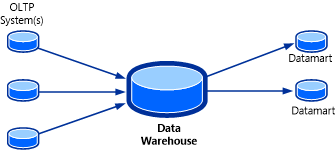
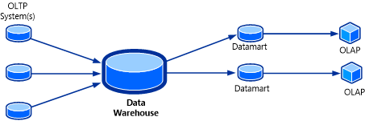

# Understanding OLAP Cubes
Online analytical processing \(OLAP\) cubes are a feature in [!INCLUDE[smlong12](../../../sm/deploy/deploy-guide/includes/smlong12_md.md)] that use the existing data warehouse infrastructure to provide self\-service business intelligence capabilities to end users.  
  
 An OLAP cube is a data structure that overcomes the limitations of relational databases by providing rapid analysis of data. Cubes can display and sum large amounts of data while also providing users with searchable access to any data points. This way, the data can be rolled up, sliced, and diced as needed to handle the widest variety of questions that are relevant to a user’s area of interest.  
  
 Software vendors or information technology \(IT\) developers with a working knowledge of OLAP cubes can create management packs to define their own extensible and customizable OLAP cubes that are built on the data warehouse infrastructure that was provided in [!INCLUDE[smshort](../../../sm/deploy/deploy-guide/includes/smshort_md.md)] 2010. These cubes are stored in SQL Server Analysis Services \(SSAS\). Self\-service business intelligence tools such as Excel and SQL Server Reporting Services \(SSRS\) can target these cubes in SSAS, and you can use them to analyze the data from multiple perspectives.  
  
 The databases that a business uses to store all its transactions and records are called online transaction processing \(OLTP\) databases. These databases usually have records that are entered one at a time and that contain a wealth of information that can be used by strategists to make informed decisions about their business. The databases that are used to store the data, however, were not designed for analysis. Therefore, retrieving answers from these databases is costly in terms of time and effort. OLAP databases are specialized databases that are designed to help extract this business intelligence information from the data.  
  
 In [!INCLUDE[smshort](../../../sm/deploy/deploy-guide/includes/smshort_md.md)] 2010, the data warehouse provided OLAP databases that contained data in simplified, read\-optimized schemas that were ready for consumption. The topology of the system is shown in the following illustration.  
  
   
  
 One drawback to this system, however, is that OLAP databases essentially contained the exact same type of information that was found in OLTP databases. There were no precalculated aggregations of data to answer increasingly complex and varied queries.  
  
 OLAP cubes can be considered as the final piece of the puzzle for a data warehousing solution. An OLAP cube, also known as multidimensional cube or hypercube, is a data structure in SQL Server Analysis Services \(SSAS\) that is built, using OLAP databases, to allow near\-instantaneous analysis of data. The topology of this system is shown in the following illustration.  
  
   
  
 The useful feature of an OLAP cube is that the data in the cube can be contained in an aggregated form. To the user, the cube seems to have the answers in advance because assortments of values are already precomputed. Without having to query the source OLAP database, the cube can return answers for a wide range of questions almost instantaneously.  
  
 The main goal of [!INCLUDE[smlong12](../../../sm/deploy/deploy-guide/includes/smlong12_md.md)] OLAP cubes is to give software vendors or information technology \(IT\) developers the ability to perform near\-instantaneous analysis of data for both historical analysis and trending purposes. [!INCLUDE[smlong12](../../../sm/deploy/deploy-guide/includes/smlong12_md.md)] does this by:  
  
-   Allowing you to define OLAP cubes in management packs that will be created automatically in SSAS when the management pack is deployed.  
  
-   Automatically maintaining the cube without user intervention, performing such tasks as processing, partitioning, translations and localization, and schema changes.  
  
-   Allowing users to use self\-service business intelligence tools, such as Excel, to analyze the data from multiple perspectives.  
  
-   Saving generated Excel reports for future reference.  
  
 To see how data warehouse cubes are represented in the [!INCLUDE[smcons](../../../sm/deploy/deploy-guide/includes/smcons_md.md)], navigate to the **Data Warehouse** workspace, and then click **Cubes**.  
  
## Understanding OLAP Cubes Topics  
  
-   [About OLAP Cubes](../../../sm/manage/operate/About-OLAP-Cubes.md)  
  
     Explains OLAP cube parts and actions that users can take using OLAP cube parts.  
  
-   [About Modeling OLAP Cubes in Management Packs](../../../sm/manage/operate/About-Modeling-OLAP-Cubes-in-Management-Packs.md)  
  
     Describes management pack elements that you can use to define and customize an OLAP cube.  
  
-   [About Cube Partitioning](../../../sm/manage/operate/About-Cube-Partitioning.md)  
  
     Explains the impact that cube partitions have on scalability and performance.  
  
-   [About Cube Processing](../../../sm/manage/operate/About-Cube-Processing.md)  
  
     Explains what occurs during cube processing.  
  
-   [About Cube Deployment](../../../sm/manage/operate/About-Cube-Deployment.md)  
  
     Explains what occurs during cube deployment.  
  
-   [Maintaining OLAP Cubes](../../../sm/manage/operate/Maintaining-OLAP-Cubes.md)  
  
     Describes best practices for maintaining OLAP cubes.  
  
-   [Troubleshooting OLAP Cubes](../../../sm/manage/operate/Troubleshooting-OLAP-Cubes.md)  
  
     Describes common problems that you might have to troubleshoot for OLAP cubes.  
  
-   [How to Create an OLAP Cube Using a Management Pack](../../../sm/manage/operate/How-to-Create-an-OLAP-Cube-Using-a-Management-Pack.md)  
  
     Describes how to create an OLAP cube by using a management pack.  
  
## Other Resources for This Component  
  
-   TechNet Library main page for [System Center 2012 – Service Manager](http://go.microsoft.com/fwlink/p/?LinkId=220655)  
  
-   [Operations Guide for System Center 2012 – Service Manager](http://go.microsoft.com/fwlink/p/?LinkId=220656)  
  
-   [Administrator's Guide for System Center 2012 – Service Manager](http://go.microsoft.com/fwlink/p/?LinkId=209669)  
  
-   [Planning Guide for System Center 2012 – Service Manager](http://go.microsoft.com/fwlink/p/?LinkId=209672)