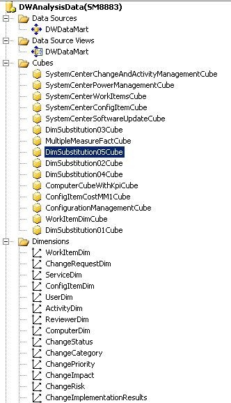
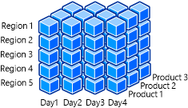

# About OLAP Cubes

The following illustration shows an image from SQL Server Business Intelligence Development Studio \(BIDS\) that depicts the main parts that are required for online analytical processing \(OLAP\) cubes. These parts are the data source, data source view, cubes, and dimensions. The following sections describe the OLAP cube parts and the actions that users can take using them.  

   

## Data Source  
 A data source is the origin of all the data that is contained within an OLAP cube. An OLAP cube connects to a data source to read and process raw data to perform aggregations and calculations for its associated measures. The data source for all Service Manager OLAP cubes is the data marts, which includes the data marts for both Operations Manager and Configuration Manager. Authentication information about the data source must be stored in SQL Server Analysis Services \(SSAS\) to establish the correct level of permissions.  

### Data Source View  
 The data source view \(DSV\) is a collection of views that represent the dimension, fact, and outrigger tables from the data source, such as the Service Manager data marts. The DSV contains all the relationships between tables, such as primary and foreign keys. In other words, the DSV specifies how the SSAS database will map to the relational schema, and it provides a layer of abstraction on top of the relational database. Using this layer of abstraction, relationships can be defined between fact and dimension tables, even if no relationships exist within the source relational database. Named calculations, custom measures, and new attributes may also be defined in the DSV that may not natively exist in the data warehouse dimensional schema. For example, a named calculation that defines a Boolean value for *Incidents Resolved* calculates the value as true if an incident’s status is resolved or closed. Using the named calculation, Service Manager can then define a measure to display useful information such as the percentage of incidents resolved, the total number of incidents resolved, and the total number of incidents that are not resolved.  

 Another quick example of a named calculation is *ReleasesImplementedOnSchedule*. This named calculation provides a quick health status check on the number of release records in which the actual end date is less than or equal to the scheduled end date.  

### OLAP Cubes  
 An OLAP cube is a data structure that overcomes limitations of relational databases by providing rapid analysis of data. OLAP cubes can display and sum large amounts of data while also providing users with searchable access to any data points so that the data can be rolled up, sliced, and diced as needed to handle the widest variety of questions that are relevant to a user’s area of interest.  

### Dimensions  
 A dimension in SSAS references a dimension from the Service Manager data warehouse. In System Center 2012 - Service Manager, a dimension is roughly equivalent to a management pack class. Each management pack class has a list of properties, while each dimension contains a list of attributes, with each attribute mapping to one property in a class. Dimensions allow the filtering, grouping, and labeling of data. For example, you can filter computers by the installed operating system and group people into categories by gender or age. The data can then be presented in a format where the data is categorized naturally into these hierarches and categories to allow a more in\-depth analysis. Dimensions may also have natural hierarches to allow users to “drill down” to more detailed levels of detail. For instance, the Date dimension has a hierarchy that can be drilled down by Year, then Quarter, then Month, then Week, and then Day.  

 The following illustration shows an OLAP cube that contains the Date, Region, and Product dimensions.  

   

 For example, Microsoft team members might want a quick and simple summary of the sales of the Xbox 360 gaming console in 2010. They can further drill down to get sales figures for a more focused time frame. Business analysts may want to examine how the sales of Xbox 360 consoles were affected by the launch of the new console design and the Kinect for Xbox 360 controller\-free gaming experience. This helps them determine what sales trends are occurring and what potential revisions of business strategy are needed. By filtering on the date dimension, this information can be quickly delivered and consumed. This slicing and dicing of data is enabled only because the dimensions have been designed with attributes and data that can easily be filtered and grouped by the customer.  

 In System Center 2012 - Service Manager, all OLAP cubes share a common set of dimensions. All dimensions use the primary data warehouse data mart as their source, even in multiple data mart scenarios. In multiple data mart scenarios, this can possibly lead to dimension key errors during processing of the cube.  

### Measure Group  
 A measure group is the same concept as a fact in data warehouse terminology. Just as facts contain numeric measures in a data warehouse, a measure group contains measures for an OLAP cube. All the measures in an OLAP cube that derive from a single fact table in a data source view also can be considered to be a measure group. There can be instances, however, in which there will be multiple fact tables from which the measures in an OLAP cube derive. Measures of the same detail level are united in one measure group. Measure groups define what data will be loaded into the system, how the data is loaded, and how the data is bound to the multidimensional cube.  

 Each measure group also contains a list of partitions, which hold the actual data in separate, nonoverlapping sections. Measure groups also contain aggregation design, which defines the presummarized data sets that are calculated for each measure group to improve the performance of user queries.  

### Measures  
 Measures are the numeric values that users want to slice, dice, aggregate, and analyze; they are one of the fundamental reasons why you would want to build OLAP cubes using data warehousing infrastructure. By using SSAS, you can build OLAP cubes that will apply business rules and calculations to format and display measures in a customizable format. Much of your OLAP cube development time will be spent determining and defining which measures will be displayed and how they will be calculated.  

 Measures are values that usually map to numeric columns in a data warehouse fact table, but they can also be created on dimension and degenerate dimension attributes. These measures are the most important values of an OLAP cube that are analyzed and the primary interest to end users who browse the OLAP cube. An example of a measure that exists in the data warehouse is ActivityTotalTimeMeasure. ActivityTotalTimeMeasure is a measure from ActivityStatusDurationFact that represents the time that each activity is in a certain status. The detail level of a measure is made up of all the dimensions that are referenced. For example, the detail level of the *ComputerHostsOperatingSystem* relationship fact consists of the Computer and Operating System dimensions.  

 Aggregation functions are calculated on measures to enable further data analysis. The most common aggregation function is Sum. A common OLAP cube query, for example, sums up the total time for all activities that are *In Progress*. Other common aggregation functions include Min, Max, and Count.  

 After the raw data has been processed in an OLAP cube, users can perform more complex calculations and queries using multidimensional expressions \(MDX\) to define their own measure expressions or calculated members. MDX is the industry standard for querying and accessing data that is stored in OLAP systems. SQL Server was not designed to work with the data model that multidimensional databases support.  

### Drill\-Down  
 When a user drills down into the data in an OLAP cube, the user is analyzing the data at a different level of summarization. The level of detail of the data changes as the user drills down, examining the data at different levels in the hierarchy. As the user drills down, he or she moves from summary information to data with a more narrow focus. The following are examples of drilling down:  

-   Drilling down into data to look at demographic information about the population of the United States, then into the state of Washington, then into the metropolitan area of Seattle, then into the city of Redmond, and finally into the population at Microsoft.  

-   Drilling down into sales figures for Xbox 360 consoles for the 2011 calendar year, then the fourth quarter of the year, then the month of December, then the week before Christmas, and finally Christmas Eve.  

### Drill Through  
 When users “drill through” data, they want to see all the individual transactions that contributed to the OLAP cube’s aggregated data. In other words, the user can retrieve the data at a lowest level of detail for a given measure value. For example, when you are given the sales data for a particular month and product category, you can drill through that data to see a list of each table row that is contained within that cell of data.  

 It is common to confuse the terms “drill down” and “drill through” with each other. The main difference between them is that a drill\-down operates on a predefined hierarchy of data—for example, USA, then into Washington, then into Seattle—within the OLAP cube. A drill\-through go directly to the lowest level of detail of data and retrieves a set of rows from the data source that has been aggregated into a single cell.  

### Key Performance Indicator  
 Organizations can use key performance indicators \(KPIs\) to gauge the health of their enterprise and their performance by measuring their progress toward their goals. KPIs are business metrics that can be defined to monitor progress toward certain predefined objectives and goals. A KPI usually has a target value and an actual value, which represents a quantitative goal that is critical to the success of the organization. KPIs are usually displayed in groups on a scorecard to show the overall health of the business in one quick snapshot.  

 An example of a KPI is to complete all change requests within 48 hours. A KPI can be used to measure the percentage of change requests that are resolved within that time frame. You can create dashboards to represent KPIs visually. For example, you might want to define a KPI target value for completion of all change requests within 48 hours to 75 percent.  

### Partitions  
 A partition is a data structure that holds some or all of the data in a measure group. Every measure group is divided into partitions. A partition defines a subset of the fact data that is loaded into the measure group. SSAS Standard Edition allows only one partition per measure group, while SSAS Enterprise Edition allows a measure group to contain multiple partitions. Partitions are a feature that is transparent to the end user, but they have a major impact on both the performance and the scalability of OLAP cubes. All partitions for a measure group always exist in the same physical database.  

 Partitions make it possible for an administrator to better manage an OLAP cube and improve an OLAP cube’s performance. For example, you can remove or reprocess the data in one partition of a measure group without affecting the rest of the measure group. When you load new data into a fact table, only the partitions that should contain the new data are affected.  

 Partitioning also improves processing and query performance for OLAP cubes. SSAS can process multiple partitions in parallel, leading to a much more efficient use of CPU and memory resources on the server. While it runs a query, SSAS fetches, processes, and aggregates data from multiple partitions as well. Only partitions that contain the data that is relevant to a query are scanned, which reduces the overall amount of input and output.  

 One example of a partitioning strategy is to place the fact data for each month into a monthly partition. At the end of each month, all the new data goes into a new partition, which leads to a natural distribution of data with nonoverlapping values.  

### Aggregations  
 Aggregations in an OLAP cube are presummarized data sets. They are analogous to a SQL SELECT statement with a GROUP BY clause. SSAS can use these aggregations when it answers queries to reduce the amount of necessary calculations, returning the answers quickly to the user. Built\-in aggregations in the OLAP cube reduce the amount of aggregation SSAS has to perform at query time. Building the correct aggregations can drastically improve query performance. This is often an evolving process throughout the lifetime of the OLAP cube as its queries and usage change.  

 A base set of aggregations is usually created that will be useful for most of the queries against the OLAP cube. Aggregations are built for each partition of an OLAP cube within a measure group. When an aggregation is built, certain attributes of dimensions are included in the presummarized data set. Users can quickly query the data based on these aggregations when they browse the OLAP cube. Aggregations must be designed carefully because the number of potential aggregations is so large that building all of them would take an unreasonable amount of time and storage space.  

 Service Manager uses the following two options when it builds and designs aggregations in Service Manager OLAP cubes:  

-   Performance Gain Reaches  

-   Usage\-based optimization  

 The Performance Gain Reaches option defines what percentage of aggregations is built. For example, setting this option to the default and recommended value of 30 percent means that aggregations will be built to give the OLAP cube a 30\-percent estimated performance gain. However, this does not mean that 30 percent of the possible aggregations will be built.  

 Usage\-based optimization makes it possible for SSAS to log the requests for data so that when a query is run, the information is fed into the aggregation design process. SSAS then reviews the data and recommends which aggregations should be built to give the best estimated performance gain.  

## See Also

 [Customizing the Data Warehouse](../../../sm/manage/operate/Customizing-the-Data-Warehouse.md)
