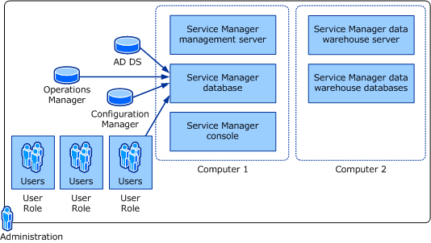

# Planning for System Center 2012 - Service Manager Deployment
For [!INCLUDE[smlong12](../../../sm/deploy/deploy-guide/includes/smlong12_md.md)], several deployment options are available, and three options are presented in this guide.  
  
 The first deployment option uses one physical computer and one virtual computer. The physical computer hosts the [!INCLUDE[smshort12](../../../sm/deploy/deploy-guide/includes/smshort12_md.md)] management server, the [!INCLUDE[smshort](../../../sm/deploy/deploy-guide/includes/smshort_md.md)] database, and the data warehouse databases, and it also hosts the virtual server. The virtual computer hosts the data warehouse management server. This deployment is used primarily for lightweight or first\-impression evaluation of [!INCLUDE[smshort](../../../sm/deploy/deploy-guide/includes/smshort_md.md)]. No scalability or performance estimates are available for this scenario.  
  
 A second deployment option requires the use of two computers. The first computer hosts the [!INCLUDE[smshort](../../../sm/deploy/deploy-guide/includes/smshort_md.md)] management server and the [!INCLUDE[smshort](../../../sm/deploy/deploy-guide/includes/smshort_md.md)] database. The second computer hosts the data warehouse management server and the data warehouse databases. If you do not need reporting services, you can—at an absolute minimum—install  [!INCLUDE[smshort](../../../sm/deploy/deploy-guide/includes/smshort_md.md)] on one computer that hosts both the Service Manager management server and the Service Manager database.  
  
 A third deployment option maximizes performance and scalability by using four computers. Two computers host the management servers, and the remaining two computers host the databases. The computers hosting the databases are the only two computers in this scenario that require the installation of Microsoft SQL Server 2008.  
  
 You might decide that, for the evaluation phase, you will choose the option to install [!INCLUDE[smshort](../../../sm/deploy/deploy-guide/includes/smshort_md.md)] on two computers. After installing [!INCLUDE[smshort](../../../sm/deploy/deploy-guide/includes/smshort_md.md)] in the lab, you can import data from Active Directory Domain Services \(AD DS\) and System Center Configuration Manager, and then you can import data and alerts from Operations Manager. You would then configure User Roles within [!INCLUDE[smshort](../../../sm/deploy/deploy-guide/includes/smshort_md.md)] and, if necessary, manually add users that were not imported from AD DS. The following illustration represents an overview of this installation and initial configuration.  
  
   
  
 You can limit the number of SQL Server licenses that you need by placing all of the [!INCLUDE[smshort](../../../sm/deploy/deploy-guide/includes/smshort_md.md)] databases on the same computer, as shown in the following illustration.  
  
   
  
 You continue the deployment process by creating several templates; configuring initial parameters; creating queues, lists, and groups; and then creating a management pack to save these custom objects.  
  
 After the evaluation phase is complete, you might install [!INCLUDE[smshort](../../../sm/deploy/deploy-guide/includes/smshort_md.md)] in a production environment and select the deployment scenario in which [!INCLUDE[smshort](../../../sm/deploy/deploy-guide/includes/smshort_md.md)] is installed on four computers.  
  
## Multiple Service Manager Management Servers and One Data Warehouse  
 The [!INCLUDE[smshort](../../../sm/deploy/deploy-guide/includes/smshort_md.md)] management server and its associated [!INCLUDE[smshort](../../../sm/deploy/deploy-guide/includes/smshort_md.md)] database make up a [!INCLUDE[smshort](../../../sm/deploy/deploy-guide/includes/smshort_md.md)] management group. The data warehouse management server and its associated databases make up a data warehouse management group. After deploying [!INCLUDE[smshort](../../../sm/deploy/deploy-guide/includes/smshort_md.md)], you will register the [!INCLUDE[smshort](../../../sm/deploy/deploy-guide/includes/smshort_md.md)] management group with the data warehouse management group.  
  
 In your enterprise, you might create multiple [!INCLUDE[smshort](../../../sm/deploy/deploy-guide/includes/smshort_md.md)] management groups. You can centralize reporting for multiple [!INCLUDE[smshort](../../../sm/deploy/deploy-guide/includes/smshort_md.md)] management groups by registering multiple [!INCLUDE[smshort](../../../sm/deploy/deploy-guide/includes/smshort_md.md)] management groups with a single data warehouse management group. For more information, see [How to Run the Data Warehouse Registration Wizard](http://go.microsoft.com/fwlink/p/?LinkID=232303).  
  
## Planning for Deployment Topics  
  
-   [System Center 2012 \- Service Manager Parts](../../../sm/plan/planning/System-Center-2012---Service-Manager-Parts.md)  
  
     Describes the six major parts of a [!INCLUDE[smshort](../../../sm/deploy/deploy-guide/includes/smshort_md.md)] installation.  
  
-   [SQL Server Requirements for System Center 2012 \- Service Manager](../../../sm/plan/planning/SQL-Server-Requirements-for-System-Center-2012---Service-Manager.md)  
  
     Describes the two SQL Server roles that are used by [!INCLUDE[smshort](../../../sm/deploy/deploy-guide/includes/smshort_md.md)], SQL Server Analysis Services \(SSAS\) and SQL Server Reporting Services \(SSRS\).  
  
-   [System Center 2012 \- Service Manager Evaluation, Retail, and Select Editions](../../../sm/plan/planning/System-Center-2012---Service-Manager-Evaluation--Retail--and-Select-Editions.md)  
  
     Describes the retail and select editions of [!INCLUDE[smshort](../../../sm/deploy/deploy-guide/includes/smshort_md.md)] and what effect selecting the 180\-day evaluation installation has on these two editions.  
  
-   [Supported Configurations for System Center 2012 \- Service Manager](../../../sm/plan/planning/Supported-Configurations-for-System-Center-2012---Service-Manager.md)  
  
     Describes the hardware and software requirements for [!INCLUDE[smshort](../../../sm/deploy/deploy-guide/includes/smshort_md.md)]. Specific considerations about the software that you need to install to support [!INCLUDE[smshort](../../../sm/deploy/deploy-guide/includes/smshort_md.md)] are included.  
  
-   [Operations Manager Considerations in System Center 2012 \- Service Manager](../../../sm/plan/planning/Operations-Manager-Considerations-in-System-Center-2012---Service-Manager.md)  
  
     Describes information that you need to know if you are planning to deploy [!INCLUDE[smshort](../../../sm/deploy/deploy-guide/includes/smshort_md.md)] in an environment that hosts Operations Manager 2007.  
  
-   [Language Support for System Center 2012 \- Service Manager](../../../sm/plan/planning/Language-Support-for-System-Center-2012---Service-Manager.md)  
  
     Describes the languages that are supported in [!INCLUDE[smshort12](../../../sm/deploy/deploy-guide/includes/smshort12_md.md)].  
  
-   [Databases Created by System Center 2012 \- Service Manager](../../../sm/plan/planning/Databases-Created-by-System-Center-2012---Service-Manager.md)  
  
     Describes the four databases that will be created as a result of deploying [!INCLUDE[smshort](../../../sm/deploy/deploy-guide/includes/smshort_md.md)].  
  
-   [Port Assignments for System Center 2012 \- Service Manager](../../../sm/plan/planning/Port-Assignments-for-System-Center-2012---Service-Manager.md)  
  
     Describes the TCP\/IP ports that [!INCLUDE[smshort](../../../sm/deploy/deploy-guide/includes/smshort_md.md)] uses.  
  
## Other Resources for This Component  
  
-   TechNet Library main page for [System Center 2012 – Service Manager](http://go.microsoft.com/fwlink/p/?LinkId=220655)  
  
-   [Planning Guide for System Center 2012 – Service Manager](http://go.microsoft.com/fwlink/p/?LinkId=209672)  
  
-   [Deployment Guide for System Center 2012 – Service Manager](http://go.microsoft.com/fwlink/p/?LinkId=209670)  
  
-   [Administrator’s Guide for System Center 2012 – Service Manager](http://go.microsoft.com/fwlink/p/?LinkId=209669)  
  
-   [Operations Guide for System Center 2012 – Service Manager](http://go.microsoft.com/fwlink/p/?LinkId=220656)